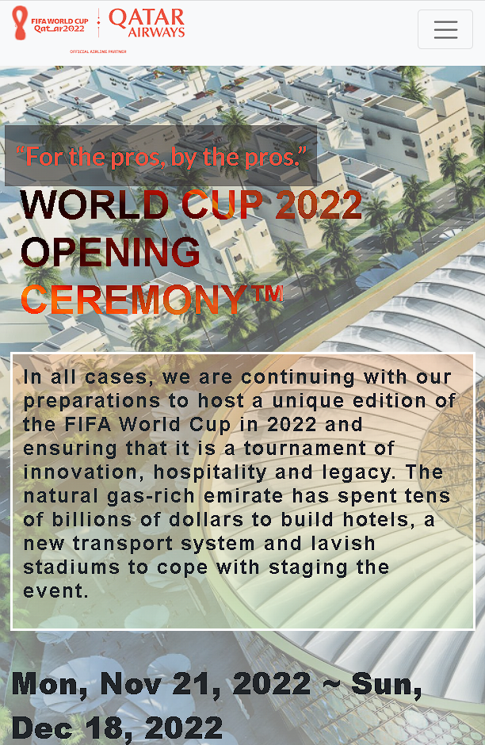
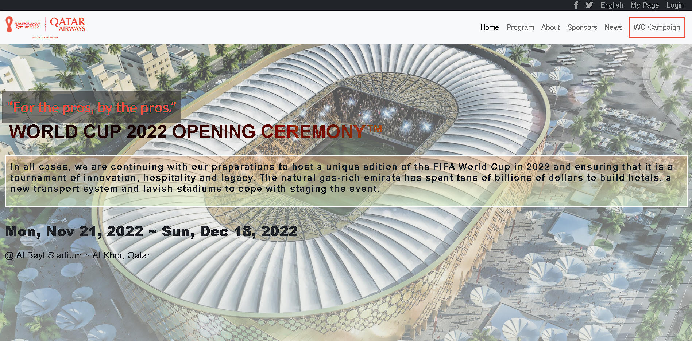

# "World Cup Qatar 2022" project

> This is my personal "World Cup Qatar 2022 International Conference" website which I created for the Microverse assignment, in this project we had to choose our own website idea and create home and about page. Since I've always been the football fan I chose to create something like fake World Cup 2022 conference, and from this moment I'm writing this all the football fans are waiting for that big moment which is in a few months from now.

 

Additional description about the project and its features.

## Built With

- HTML
- CSS
- SASS
- JavaScript
- Linters
- FontAwesome
- Bootstrap
- GitHub/VSCode
- jQuery

## Live Demo

[Live Demo Link](https://saidrasinlic.github.io/WorldCupQatar/)

## Getting Started

To get a local copy up and running follow these simple example steps.

### Prerequisites

- GitHub/VSCode/Linters

### Setup

- gh repo clone SaidRasinlic/WorldCupQatar

## Authors

👤 **Author1**

- GitHub: [@GitHub/SaidRasinlic](https://twitter.com/SaidRasinlic)
- Twitter: [@Twitter/SaidRasinlic](https://twitter.com/SaidRasinlic)
- LinkedIn: [LinkedIn/SaidRasinlic](https://www.linkedin.com/in/saidrasinlic)

## 🤝 Contributing

Contributions, issues, and feature requests are welcome!

Feel free to check the [issues page](../../issues/).

## Show your support

Give a ⭐️ if you like this project!

## Acknowledgments

- Microverse 

## 📝 License

This project is [MIT](LICENSE) licensed.
